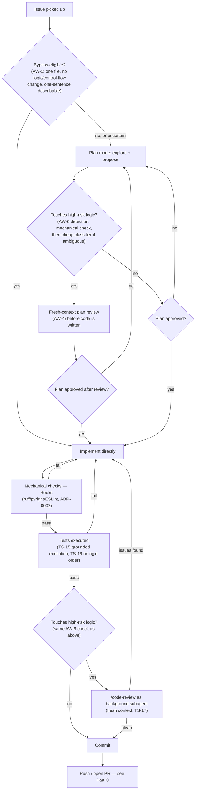
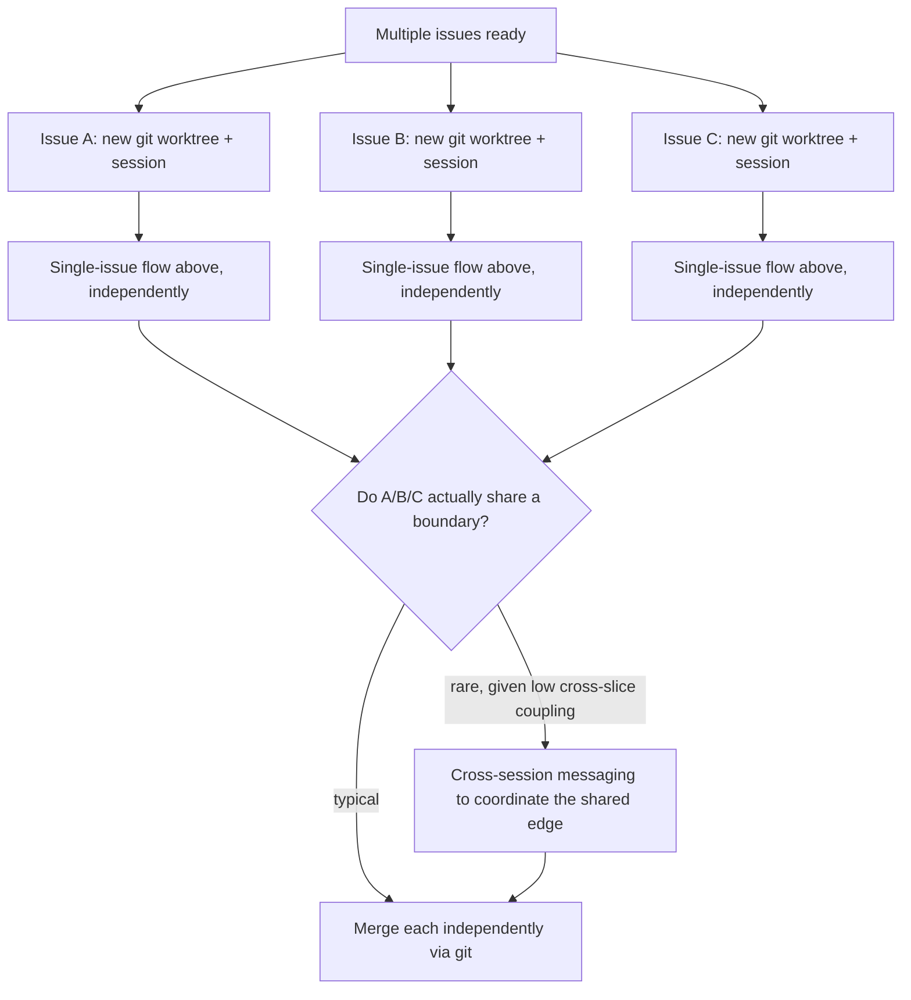
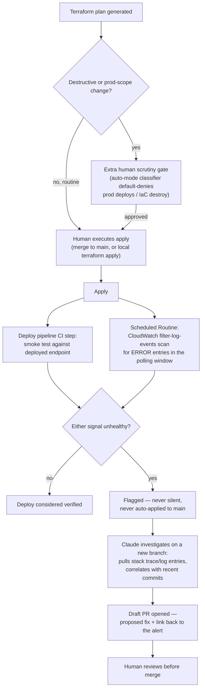
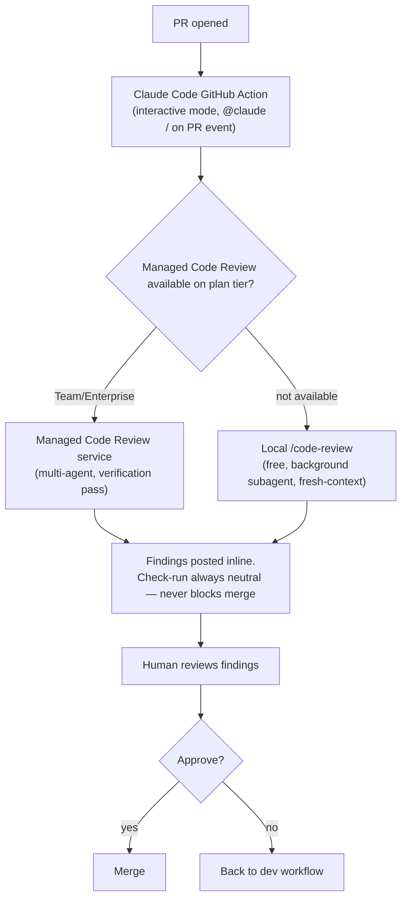

# Point 4 — Final agentic workflow and processes documentation
 
Step 4 of point 4, following `ADR-0004` (topology principles, and role/gate assignment for dev/deployment/review, plus plan-template, documentation, bypass, and detection-mechanism decisions). This is where the concrete flow diagrams, literal templates, and worked mechanics live — the ADR states decisions and why; this states how they're wired. Rule IDs use `AW-` (Agentic Workflow), each tagged with a recommended implementation surface using ADR-0002's taxonomy plus two additions specific to this point: **Routine** (a scheduled/triggered cloud Routine) and **GitHub Action config** (the Action's own configuration, distinct from a repo Hook).
 
## A. Dev workflow
 
### Single-issue flow
 

 
### Multi-issue (parallel) flow
 

 
### Rules
 
| ID | Rule | Surface | Notes |
|---|---|---|---|
| AW-1 | Bypass check runs first, before any plan-mode invocation: one file touched, no logic/control-flow change, describable in one sentence. Default to planning when uncertain. | Agent/task def | ADR-0004 Part 7. Never line-count-based (AW-1 doesn't check diff size). |
| AW-2 | A new worktree + ordinary session is created per ready issue, never a subagent or Agent Team, for parallel work | Agent/task def | ADR-0004 Part 2, Principle 2 |
| AW-3 | Cross-session coordination between worktrees happens only when a real shared boundary is hit — flagged explicitly by whichever session finds it, not assumed upfront | Agent/task def | Exception path, expected rare per ADR-0001's low-coupling design |
 
## B. Plan template
 
Fixed floor applies to every plan; conditional rows apply only when the change is multi-file, touches unfamiliar code, or has an uncertain approach (mirrors AW-1's bypass criterion in reverse).
 
| Field | Tier | Notes |
|---|---|---|
| Affected files/interfaces | Fixed floor | Anthropic's own minimum-viable spec recipe |
| Out-of-scope statement | Fixed floor | What this change explicitly does *not* touch |
| End-to-end verification step | Fixed floor | How "done" will be proven, not just asserted |
| Objective | Conditional | One line — why this change, not just what |
| Boundaries tier | Conditional | ✅ Always do / ⚠️ Ask first / 🚫 Never do — a real-world pattern found in research, more actionable than a plain "risks" list |
| Open questions | Conditional | Anything genuinely unresolved going in |
| Complexity justification | Conditional | "Simpler alternative rejected because…" — only needed if the plan reaches for more machinery than the task obviously requires |
| High-risk-logic flag | Conditional, but always checked | Set by AW-6's detection mechanism, not self-declared by the planning agent alone |
 
| ID | Rule | Surface | Notes |
|---|---|---|---|
| AW-4 | A plan flagged high-risk (AW-6) gets a fresh-context review of the plan itself before implementation starts, using the same subagent mechanism as `/code-review` but pointed at the plan, not a diff | Agent/task def | ADR-0004 Part 5. Scoped identically to TS-17 — not universal. |
| AW-5 | The plan template's fixed-floor fields are non-negotiable; conditional fields are skipped, not left blank, when the change doesn't meet AW-1's escalation triggers | Agent/task def | Keeps trivial-but-not-bypass-eligible tasks from inheriting full ceremony |
 
## C. Deployment workflow
 

Two corrections against the diagram's own earlier shape, both already reflected above: **every** apply is human-executed now, not just destructive/prod ones — `branching_strategy.md`'s AW-24 tightened ADR-004 Part 3's original "routine changes may apply directly" after this document was first written; that ADR text itself hasn't been amended yet (tracked in [issue #19](https://github.com/LouayBks/spiresen-saga/issues/19), flagged as an open conflict, not silently resolved). And the smoke test is a **deploy-pipeline CI step**, not a `PostToolUse` Hook — `claude_code_setup.md` section E already explains why a hook can't reliably fill this role (it's scoped to a tool call, not to deployment completion); this diagram previously said otherwise and is now corrected to match.

A second, independent entry point feeds the same investigate→branch→PR path: a standing monitoring Routine (not tied to a specific deploy) that fires on its own schedule or when an external monitoring tool calls its endpoint, per Claude Code's documented "alert triage" Routines pattern.
 
| ID | Rule | Surface | Notes |
|---|---|---|---|
| AW-6 | High-risk-logic / escalation detection is two-tier: (1) a Hook checks touched file paths and imports against a maintained list of risk-flagged modules (auth/authorization, cross-slice boundaries, data-invariant transactions — the set was revised 2026-09-19 when fractional ordering left the data model); (2) only if that's ambiguous, a cheap classifier subagent makes the call. The primary implementing agent never makes this call unassisted. | Hook + Agent/task def | ADR-0004 Part 8. The maintained risk-path list is a small config file, reviewed whenever a new high-risk area is named (e.g., a future ADR). |
| AW-7 | Post-deploy health check requires both an HTTP smoke test and a CloudWatch `filter-log-events` scan for ERROR-level entries in the same window; either failing flags unhealthy | Hook + Routine | ADR-0004 Part 3 |
| AW-8 | A detected issue (post-deploy or from the standing monitoring Routine) triggers: investigate → new branch → draft PR with the fix and a link to the alert. Never auto-merge, never silent-log-only. | Routine | Mirrors Claude Code's documented Routines "alert triage" example verbatim |
| AW-9 | Destructive/prod-scope Terraform changes require human approval before apply; `autoMode.environment` allowlisting of specific safe operations is Lou's call, not inherited from tool defaults | GitHub Action config / Agent/task def | ADR-0004 Part 3, Consequences — explicitly unresolved by the ADR, resolved here only if/when Lou sets it |
| AW-10 | Rollback is always a human decision — an unhealthy flag never triggers an autonomous rollback | Agent/task def | ADR-0004 Part 3 |
 
## D. Review workflow ("gh claude")
 

**Current implementation status, not just the target shape**: `claude-review.yml` today always runs the local `/code-review` path (node E) — the managed-service branch (node D) has no real integration behind it yet, `CLAUDE_REVIEW_TIER=managed` would just be a prompt string with nothing to switch to. Wiring an actual managed-service branch is tracked, not silently assumed done.

**Node B's two trigger shapes, reconciled (2026-09-18):** the diagram names both "on PR event" (automatic) and "`@claude`" (interactive/on-demand) as the same entry point, but only the automatic half existed until now — `claude-review.yml`'s `permissions:` was also missing `id-token: write`, so even that automatic half was silently failing (the OIDC token request errored before the review step ran, masked by the check-run's hardcoded-neutral conclusion). Both are fixed as of this note: `claude-review.yml` has `id-token: write`, and `claude-review-on-demand.yml` adds the `@claude`/`on-demand` half, triggered by commenting `/review` on a PR.

| ID | Rule | Surface | Notes |
|---|---|---|---|
| AW-11 | Every non-draft PR into `int` (dev → int) routes through the GitHub Action automatically — not opt-in per PR; the `int` → `main` promotion PR is deliberately not re-reviewed (2026-09-19). A draft PR is re-evaluated once it's marked ready for review (the workflow's `ready_for_review` trigger), but one merged while still draft would never get reviewed — a deliberate cost trade-off (drafts iterate heavily), not an oversight. | GitHub Action config | ADR-0004 Part 4 |
| AW-12 | Review surface (managed service vs. local `/code-review`) is selected automatically by plan-tier availability, checked once and cached, not re-verified per PR | GitHub Action config | Verify plan-tier availability once when wiring this up (ADR-0004's named unresolved item) |
| AW-13 | Check-run conclusion is always neutral regardless of findings — merge authority never leaves the human reviewer | GitHub Action config | Matches Part 3's same default-deny-on-unapproved-merge posture |
 
## E. Code documentation for discovery
 
| ID | Rule | Surface | Notes |
|---|---|---|---|
| AW-14 | Root `CLAUDE.md`: pointers + critical gotchas only, under ~200 lines | CLAUDE.md prose | Point 1, reconfirmed ADR-0004 Part 6 |
| AW-15 | Per-slice `CLAUDE.md` for local convention, loaded additively on entry | CLAUDE.md prose | Point 1 |
| AW-16 | Install Claude Code's LSP-based code-intelligence plugin for this stack (TypeScript/Python) | Agent/task def (one-time setup) | Prefer over grep for symbol lookup |
| AW-17 | Periodically verify LSP is actually being invoked in real sessions (e.g., spot-check a session's tool-use log for LSP calls vs. grep), not just that the plugin is installed | Skill | ADR-0004 Part 6 — installed ≠ used, per research |
| AW-18 | No standalone `ARCHITECTURE.md`; the vertical-slice directory structure is the map | N/A — deliberate absence | Revisit only if the structure stops being self-describing |
| AW-19 | No embedding/semantic-search index | N/A — deliberate absence | Disproportionate at this scale |
| AW-20 | Periodic doc-freshness pass: check that files/symbols referenced in CLAUDE.md still exist | Skill | Matches TS-5's periodic-check pattern; agent-config files measurably rot over time |
 
## F. Summary: rule count by surface
 
| Surface | Count |
|---|---|
| Agent/task def | 8 (AW-1, 2, 3, 4, 5, 6 partial, 9 partial, 10) |
| Hook | 2 (AW-6 partial, 7 partial) |
| Routine | 2 (AW-7 partial, 8) |
| GitHub Action config | 4 (AW-9 partial, 11, 12, 13) |
| Skill | 2 (AW-17, 20) |
| CLAUDE.md prose | 2 (AW-14, 15) |
| N/A — deliberate absence | 2 (AW-18, 19) |
| One-time setup | 1 (AW-16) |
 
Same pattern as points 2/3: most weight sits on Agent/task def because this point is fundamentally about *how work gets scoped, escalated, and handed off*, which a Hook alone can't decide — Hook/Routine coverage handles what's genuinely deterministic (mechanical risk-path checks, smoke tests, log scans), and Skill is reserved for periodic, cost-proportionate checks rather than every-session gates.
 
## Note on what this closes
 
AW-4 and AW-6 give TS-17 (ADR-0003) its concrete wiring — point 3 named *when* review is required, this point defines *how* that's detected and *who* performs it. AW-14/15/16 absorb point 1's seed content (root CLAUDE.md hygiene, LSP-over-grep) into this point's actual workflow rather than leaving it stranded as carried-forward notes. AW-9's `autoMode.environment` allowlist and AW-12's plan-tier check are the two items ADR-0004 named as real decisions surfaced but not resolved — both need a one-time setup pass when this is actually wired into the repo, not a further research/ADR cycle.