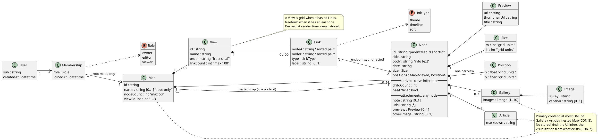

# Data cartography — #36 data foundation

**Status: proposal, not yet accepted.** Drafted 2026-09-19 for ticket #36, before implementation. It has not been through the AW-4 `plan-reviewer` pass, and `application_architecture.md` (the schema source of truth) is **not** updated until it is accepted — at which point this doc's physical layout moves there and this doc keeps the cross-cutting map (entities, access patterns, invariants, limits).

**What this is:** one place that maps every piece of data the app stores — what it is, where it lives, who can touch it, what reads and writes it, and what keeps it consistent. **What it is not:** a spec. Behavior lives in `DOC/specs/*.md` (ADR-006); this doc cites spec rule IDs and turns them into storage requirements. Where a spec still asserts a PK/SK shape, this doc supersedes it (per ADR-006's amendment).

Naming follows `naming.md`: **Map** (per-user collection) and **Node** (canvas item). "Saga" is the product brand only.

## 1. Domain model

Reading notes:
- There is **no `kind`** on Node and **no `userId`** on any Node or Map content. Identity lives only on Membership (`application_architecture.md`, multi-tenancy).
- A Node's visualization is **computed, never stored**, in this order (`content-authoring.md` CON-7): 2+ children → map; exactly 1 child → click-through; `images` present → gallery; article attached → article; otherwise info. `childCount` and `hasArticle` exist only so a parent Map can be rendered from one query without asking each child.
- **Primary content is exclusive** (CON-8): at most one of Gallery / Article / nested Map. Attachments (`note`, `urls`, `preview`, `coverImage`) are orthogonal and allowed on every node (CON-4, CON-9).
- **Layout is derived per View** (`window-system.md` CON-6): no Links → grid, at least one → freeform. Nothing stores it.
- `body` is the info-node text (the primary text of an info visualization); `note` is a side annotation any node can carry. They are deliberately different fields.

## 2. Entity catalogue

| Entity | Identity | Owned by | Stored attributes | Spec source |
|---|---|---|---|---|
| User | Cognito `sub` (never email) | itself | `createdAt` only — email/name come from JWT claims, not stored | accounts-and-auth CON-1 |
| Membership | (`sub`, root Map id) | User ↔ root Map | `role` (`owner` only in v1), `joinedAt` | accounts-and-auth CON-3 |
| Map | root: minted id; nested: its parent Node's id | Membership (root) / parent Node (nested) | `name` (root only), `nodeCount`, `viewCount` | naming, window-system CON-3/4 |
| View | minted id | Map | `name`, `order`, `linkCount` | alternate-views |
| Node | `{parentMapId}.{shortId}` | Map | `title`, `body`, `date`, `size {w,h}`, `positions {viewId → {x,y}}`, `childCount`, `hasArticle`, `note`, `urls[]`, `preview`, `coverImage`, `images[]` (gallery) | box-sizing, content-authoring, alternate-views |
| Link | unordered node pair + View | View | `nodeA`, `nodeB` (sorted), `type`, `label` | node-link-lifecycle |
| Article body | the owning Node's id | Node | `markdown` | content-authoring CON-3, CON-5 |

**Field notes**
- `size`: two integers, min 1, max 12 (tunable constant), default 1×1, identical across Views (box-sizing CON-1/CON-2). `positions` values use the same grid unit; grid layout snaps at render time and stored freeform positions are only overwritten by an explicit drag.
- `preview`: at most one per node — the first recognised-provider URL (YouTube in v1), fetched once via oEmbed at attach time. `urls` is a plain list of strings with no count cap.
- `images`: at most 10 `{s3Key, caption?}`. Bytes never touch Lambda (content-authoring CON-2); only keys are stored.
- `type`: `theme | timeline | soft`. Presentation label only — it drives no layout or logic. The value set is inconsistent across `boxes-plan.md` (which also says `causal`) and needs a spec fix; the store treats it as a validated string so changing the set needs no migration.
- Provisioned defaults: a new top-level Map gets 1 View and 2 placeholder Nodes joined by 1 Link (accounts-and-auth BHV-1/BHV-7). Placeholder copy is a code constant.

## 3. Physical layout (proposed)

One table, generic key attributes `PK` and `SK` (both strings), on-demand billing, point-in-time recovery on, deletion protection on, no GSI and no LSI in v1. A TTL attribute is reserved for a future trash bin (#45), unused now.

| Item | PK | SK |
|---|---|---|
| User profile | `USER#{sub}` | `PROFILE` |
| Membership | `USER#{sub}` | `MEMBER#{rootMapId}` |
| Map meta | `MAP#{mapId}` | `META` |
| View | `MAP#{mapId}` | `VIEW#{viewId}` |
| Node | `MAP#{mapId}` | `NODE#{shortId}` |
| Link | `MAP#{mapId}` | `LINK#{viewId}#{lo}#{hi}` (`lo`/`hi` = sorted node short ids) |
| Article body | `CONTENT#{nodeId}` | `ARTICLE` |

- **One Query opens a Map**: `PK = MAP#{mapId}` returns META, all Views, Nodes and Links together (alternate-views CON-4, ticket "no N+1"). A nested Map is the same shape one level down, with `mapId` = the group Node's id.
- **Parent lookup from an id needs no read**: split at the last dot. Node `r.a.b` is item `NODE#b` in partition `MAP#r.a`; the root Map is the first segment `r`.
- **Positions live inside the Node item**, so a drag is one narrow `SET positions.#view` update (alternate-views' single-write requirement) and item count never scales with nodes × views. Trade-off accepted: deleting a View cannot atomically strip its position from every Node. The View item is deleted first; leftover `positions[viewId]` entries and Links are best-effort cleanup, harmless because readers ignore unknown viewIds and viewIds are never reused.
- **The article body is a separate item** so a Map query never carries markdown. It is keyed by node id, so no `sagaId`/`mapId` attribute is needed to authorize it.
- **Deferred**: a `MAP#ALL` directory (or a sparse GSI) for listing all Maps. Nothing in the specs consumes it; Map visibility is still an open item. If built, the item must be immutable (pointer only: `mapId`, `ownerSub`, `createdAt`) to avoid hot-key writes and a second copy of the Map name (accounts-and-auth CON-6).

## 4. Access patterns

| # | Pattern | Operation | Notes |
|---|---|---|---|
| AP-1 | First authenticated request provisions a User | `TransactWriteItems` | Puts profile (`attribute_not_exists`), Membership, Map META, default View, 2 Nodes, 1 Link (7 items). A concurrent duplicate fails the profile condition; the handler re-reads and returns the existing Map (accounts-and-auth CON-7). |
| AP-2 | List "Your Maps" | `Query USER#{sub}` `begins_with MEMBER#`, then `BatchGetItem` of each META | Two calls, paginated at 100. The name lives only in META — never copied onto Membership (CON-6). |
| AP-3 | Open a Map | one `Query PK = MAP#{id}` | Also used for nested Maps and for BHV-6 of window-system. |
| AP-4 | Authorize any write | one consistent `GetItem USER#{sub} / MEMBER#{rootId}` | Root id = first dot segment of the id in the request. |
| AP-5 | Drag a Node | `UpdateItem SET positions.#viewId` | Debounced on pointer-up. |
| AP-6 | Create a Node | `TransactWriteItems` | Put Node (with a `positions` entry for every existing View — one small Query of the Views first), Update META `nodeCount + 1` (condition `< 50`), ConditionCheck on the parent Node exists, and when nested, Update the parent Node `childCount + 1` (condition: no gallery, no article). |
| AP-7 | Create a Link | `TransactWriteItems` | Put Link (`attribute_not_exists` — the sorted-pair key enforces "one per pair per View" in either direction), ConditionCheck on both endpoint Nodes (same Map), Update View `linkCount + 1` (condition `< 100`). |
| AP-8 | Delete a Link | `TransactWriteItems` | Delete Link, Update View `linkCount − 1`. |
| AP-9 | Delete a Node (cascade) | Delete + cleanup | Delete the Node first (subtree becomes unreachable), then its Links (`Query begins_with LINK#` on the Map, filter in code) and, if it has children, the whole nested partition recursively. Not atomic above 100 items — see §6. |
| AP-10 | Create / delete a View | `TransactWriteItems` | META `viewCount` conditions enforce 1..3 (BHV-2/3). Delete = View item first, then best-effort cleanup. |
| AP-11 | Attach / remove an article | `TransactWriteItems` | Put/Delete article item + Update Node `hasArticle`; attach requires `childCount = 0` and no `images`. |
| AP-12 | Rename a Map | `UpdateItem` on META | The single canonical name (CON-6). |
| AP-13 | Add / remove gallery images | `UpdateItem` on the Node | Requires `childCount = 0` and `hasArticle = false`; cap 10. |

There is **no Scan** anywhere in v1.

## 5. Invariants and how each is enforced

| Invariant | Source | Enforcement |
|---|---|---|
| Exactly one User and one Map per first login, even on retry/race | accounts-and-auth CON-7 | AP-1 conditional put on the profile inside one transaction |
| A write is allowed only with a Membership on the root Map | accounts-and-auth BHV-6 | AP-4 on every write route; `ALLOWED_WRITER_SUBS` deleted in the same change (CON-2) |
| A client cannot forge a node id into a Map they don't own | derived | Strict id regex (no `#`, fixed alphabet); PK built only from the validated id; parent Node must exist (ConditionCheck), so no stray partitions can be minted under an owned root |
| Map has 1..3 Views | alternate-views CON-1 | META `viewCount` condition in a transaction |
| Map has ≤ 50 Nodes; View has ≤ 100 Links | limits, §7 | `nodeCount` / `linkCount` conditions in the same transaction as the create |
| At most one Link per unordered node pair per View | node-link-lifecycle CON-2 | sorted-pair sort key + `attribute_not_exists` |
| A Link joins two Nodes of the same Map; no self-link | node-link-lifecycle CON-1/CON-4 | ConditionChecks on both endpoints in one partition; reject `nodeA = nodeB` |
| Primary content exclusivity (children / gallery / article) | content-authoring CON-8 | conditions on `childCount`, `images`, `hasArticle` on the same Node item as the write |
| Size is `w,h` integers in range | box-sizing CON-2 | request validation (Pydantic), one constant for the max |
| Every Map always has ≥ 1 View | alternate-views CON-1 | created with the Map; last-View delete rejected |
| Map name is one canonical value | accounts-and-auth CON-6 | stored only in root META; never denormalized |
| Only `owner` memberships exist in v1 | accounts-and-auth CON-3 | provisioning code path is the only writer |
| Layout mode is never stored | window-system CON-6 | there is no attribute for it |

## 6. Lifecycle and risk notes

- **DynamoDB limits that shape this**: 400 KB per item; 100 items per transaction; 25 per batch write; 1 MB per Query page; a single partition key is capped near 1000 WCU / 3000 RCU per second. At 50 Nodes a Map load is roughly 50–150 KB, well inside one page.
- **Cascade delete is not atomic beyond 100 items.** Deleting a Node with a large nested subtree deletes the Node item first, which makes everything below it unreachable, then cleans up orphan partitions synchronously in bounded batches. With ≤ 50 Nodes per Map and nesting, the worst case is bounded per level but recursive; if a cleanup fails midway the leftovers are unreachable, not corrupt. A sweeper for orphans is a future item, not v1.
- **Derived counters** (`nodeCount`, `viewCount`, `linkCount`, `childCount`, `hasArticle`) can drift only if a write path bypasses the transaction that maintains them. They are written only inside those transactions, and every one of them has a test (TS-2/TS-3).
- **New View vs. concurrent node create** can leave a Node without a position in the new View. Readers fall back to the Node's position in another View; a new View is seeded by copying the active View's positions.
- **Write cost**: DynamoDB bills a write on the whole item size, so keep Node items small (§7 caps) — that is the reason `positions` lives on the Node (~1 KB) and not on a shared View item that would grow with every Node.
- **Testing**: `moto` (TS-2) is the test double, but its fidelity on `TransactWriteItems` condition failures is exactly the risk TS-5 names. Add a small set of hand-run checks against a real dev table for AP-1, AP-6, AP-7 and AP-9.

## 7. Limits

All are constants in one settings module — tunable without a schema change.

| Limit | Value | Basis |
|---|---|---|
| Nodes per Map | **50** (decided 2026-09-19) | one-page Map load; "tens of boxes, not thousands" (`boxes-plan.md`) |
| Links per View | 100 | proposal: about 2 per Node at 50 Nodes — confirm |
| Views per Map | 3 | alternate-views CON-1 |
| Node `size` max | 12 per side | proposal — a grid needs some bound |
| Images per gallery | 10 | content-authoring CON-10 |
| `urls` per Node | no count cap | guarded only by the Node's serialized size (about 64 KB) — proposal |
| `title` / `note` / `body` | 200 / 1,000 / 10,000 chars | proposal; the UI's overflow warning stays soft |
| Link `label`, Image `caption` | 100 / 200 chars | proposal |
| Map name / View name | 100 / 50 chars | proposal |
| Article markdown | 100K chars | proposal; far under the 400 KB item limit |
| Nesting depth | no cap | window-system decision; key-length limits are nowhere near |
| Image upload | 10 MB, jpg/png/webp | content-authoring CON-1 |

## 8. Identifiers

- Root Map id: a time-sortable random id (ULID or UUIDv7 form), minted server-side, no dots. Node short id: 12 random characters from a fixed alphabet, unique per Map. Both validated by regex on every request.
- Node id = `{parentMapId}.{shortId}`; a nested Map's id is its parent Node's id. The dot path encodes full ancestry, so the owning root Map is always the first segment (O(1) authorization, no tree walk).
- Ids are never reused, and are minted by the server only.

## 9. Authorization flow

1. Cognito JWT → `sub` (never email).
2. First request for an unknown `sub` → AP-1.
3. Any write: parse the target id → root Map id (first dot segment) → AP-4 consistent read of the Membership → 403 if absent.
4. v1 has only `owner`, so this is a pure existence check; role branching stays inert until a sharing feature exists (CON-3).
5. Reads of public content stay unauthenticated; Map visibility (public/private/unlisted) is an open item and not decided here.

This path is the "auth-allowlist" and "cross-slice-authorization" high-risk area (AW-6): implementing it needs the AW-4 fresh-context plan review first.

## 10. Map-as-Code (#23) implications

- The JSON export/import is a **nested tree** (Map → Nodes → child Map), using **local ids and view names**, not storage ids, so an import mints fresh ids and never collides across accounts.
- Pydantic models are the published schema (`model_json_schema`); a single mapper module translates them to and from items, so repositories never leak key shapes. Every content shape stays flat and serializable (content-authoring CON-12).
- The JSON keeps `gallery`, `article` and `children` as separate optional keys with a validator allowing at most one — this is what stops a generated document from stuffing everything into one node, without reintroducing a stored `kind`.
- An import writes the Map's items first and the Membership last, so a half-written import is invisible and can be swept up. Imports over 100 items cannot be one transaction.
- The 50-Node cap applies to imports; an over-cap document is rejected before any write.

## 11. Infrastructure impact (human applies — AW-24)

Add to the `api` Terraform module: the table (`PAY_PER_REQUEST`, point-in-time recovery, deletion protection, hash key `PK`, range key `SK`), a Lambda IAM policy scoped to that table's ARN (`GetItem`, `PutItem`, `UpdateItem`, `DeleteItem`, `Query`, `BatchGetItem`, `BatchWriteItem` — `TransactWriteItems` is authorized through the underlying write actions), a `TABLE_NAME` environment variable, and an output. Claude writes the Terraform; a human runs `plan`/`apply`.

## 12. Open items

1. `MAP#ALL` directory vs. sparse GSI — deferred until a consumer exists (visibility spec / landing page).
2. Grid drag-rearrange: is a drag inside a grid View persisted, and where (`window-system.md` open question)?
3. `LinkType` value set (`theme | timeline | soft` vs. `causal`) — spec inconsistency to resolve.
4. Confirm the proposed limits marked "proposal" in §7.
5. Whether "+ New Map" seeds the two placeholders like first login (currently assumed yes).
6. Map visibility (public/private/unlisted) — inherited open item.
7. Amend `boxes-plan.md` (§2 schema, §4 tiers, §7a) — flagged by the specs' "updates once accepted" notes, not done here.

## 13. Traceability

`naming.md` CON-1/CON-3 (words) · `box-sizing.md` CON-1..3 (size) · `content-authoring.md` CON-2, CON-3, CON-7..12 (content, previews) · `alternate-views.md` CON-1..5 (Views, positions, Links) · `node-link-lifecycle.md` CON-1..6 (create/delete, Link rules) · `window-system.md` CON-3/4/6 (nested Map, derived layout) · `accounts-and-auth.md` CON-1..7 (identity, membership, provisioning).

